# Zuul 网关实现原理深度分析

> 基于 `zuul-hoxton` 示例工程源码 + Zuul 核心依赖字节码反编译分析
> Spring Boot `2.3.12.RELEASE` · Spring Cloud `Hoxton.SR12` · spring-cloud-netflix `2.2.9.RELEASE` · zuul-core `1.3.1`

---

## 目录

- [一、项目概览与版本说明](#一项目概览与版本说明)
- [二、Zuul 整体架构](#二zuul-整体架构)
- [三、核心概念](#三核心概念)
- [四、启动与自动装配流程](#四启动与自动装配流程)
- [五、请求处理工作流程](#五请求处理工作流程)
- [六、过滤器链执行原理](#六过滤器链执行原理)
- [七、请求路由转发实现原理](#七请求路由转发实现原理)
- [八、与 Spring Cloud 整合原理](#八与-spring-cloud-整合原理)
- [九、底层实现原理补充](#九底层实现原理补充)
- [十、本项目示例调用链分析](#十本项目示例调用链分析)
- [十一、Zuul 1.x 的局限与演进](#十一zuul-1x-的局限与演进)
- [十二、总结](#十二总结)

---

## 一、项目概览与版本说明

### 1.1 工程模块

本示例是一个典型的 Spring Cloud Netflix 微服务 demo，由 6 个 Maven 模块组成：

| 模块 | 角色 | 端口 | 注册服务名 |
|------|------|------|-----------|
| `eureka-server` | 服务注册中心（Eureka Server） | 8761 | eureka-server |
| `product-service-01` | 商品服务实例 1 | 9090 | product-service |
| `product-service-02` | 商品服务实例 2 | 9091 | product-service |
| `product-service-03` | 商品服务实例 3 | 9092 | product-service |
| `order-service` | 订单服务（服务消费方） | 8080 | order-service |
| `zuul-server` | **Zuul 网关** | 9000 | zuul-server |

三个 `product-service` 实例使用相同的服务名 `product-service`，用于演示网关 + Ribbon 的**客户端负载均衡**。

### 1.2 依赖版本（已通过 `spring-cloud-dependencies-Hoxton.SR12.pom` 确认）

```
spring-cloud-dependencies : Hoxton.SR12
  └── spring-cloud-netflix-dependencies : 2.2.9.RELEASE
        ├── spring-cloud-netflix-zuul : 2.2.9.RELEASE   (Spring 整合层)
        ├── zuul-core                    : 1.3.1           (Netflix 核心层)
        ├── spring-cloud-netflix-ribbon  : (Ribbon 负载均衡)
        ├── spring-cloud-netflix-hystrix : (熔断降级)
        └── eureka-client                : (服务发现)
```

> **关键事实**：Spring Cloud Netflix 使用的永远是 **Zuul 1.x**（基于 Servlet 的同步阻塞模型）。Netflix 后来开源的 Zuul 2.x（基于 Netty 的异步非阻塞模型）从未被 Spring Cloud 整合。因此本文分析的是 Zuul 1.x 的实现。

### 1.3 网关模块核心代码

`zuul-server/pom.xml` 依赖：

```xml
<dependency>
    <groupId>org.springframework.cloud</groupId>
    <artifactId>spring-cloud-starter-netflix-zuul</artifactId>
</dependency>
<dependency>
    <groupId>org.springframework.cloud</groupId>
    <artifactId>spring-cloud-starter-netflix-eureka-client</artifactId>
</dependency>
<dependency>
    <groupId>org.springframework.cloud</groupId>
    <artifactId>spring-cloud-starter-netflix-hystrix-dashboard</artifactId>
</dependency>
```

启动类：

```java
@EnableZuulProxy        // 开启 Zuul 代理（整合 Eureka/Ribbon/Hystrix）
@SpringBootApplication
@EnableHystrixDashboard // 开启 Hystrix 监控面板
public class ZuulServerApplication { ... }
```

自定义过滤器：

```java
@Component
public class CustomFilter extends ZuulFilter {
    @Override public String filterType()   { return "pre"; }   // 前置过滤器
    @Override public int  filterOrder()    { return 0; }        // 执行顺序
    @Override public boolean shouldFilter() { return true; }    // 总是执行
    @Override public Object run() {                            // 具体逻辑
        RequestContext rc = RequestContext.getCurrentContext();
        HttpServletRequest request = rc.getRequest();
        logger.info("CustomFilter...method={}, url={}", request.getMethod(), request.getRequestURL());
        return null;
    }
}
```

---

## 二、Zuul 整体架构

Zuul 在本项目中承担**统一入口网关**职责：所有外部请求先打到网关（9000 端口），由网关完成**路由转发、负载均衡、熔断降级、过滤拦截**后，再分发到后端微服务。

### 2.1 整体架构图

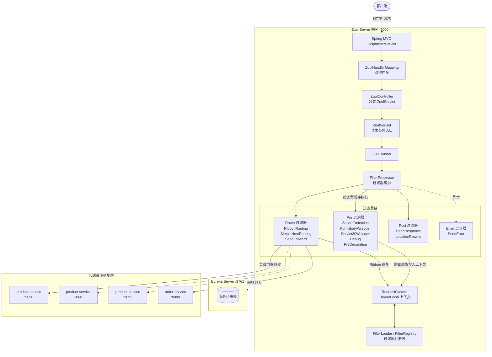

### 2.2 分层职责

| 层次 | 组件 | 所属 jar | 职责 |
|------|------|---------|------|
| **接入层** | `DispatcherServlet` → `ZuulHandlerMapping` → `ZuulController` | spring-cloud-netflix-zuul | 将 Zuul 嵌入 Spring MVC 请求分发体系 |
| **引擎层** | `ZuulServlet` → `ZuulRunner` → `FilterProcessor` | zuul-core | 驱动 pre→route→post→error 生命周期 |
| **上下文层** | `RequestContext` | zuul-core | ThreadLocal 持有的请求级数据容器，过滤器间通信总线 |
| **过滤器层** | 各 `ZuulFilter` 实现 | spring-cloud-netflix-zuul | 实际业务：路由决策、转发、响应、错误处理 |
| **路由层** | `RouteLocator` 体系 | spring-cloud-netflix-zuul | 加载与匹配路由规则（配置 + 服务发现） |
| **转发层** | Ribbon / HttpClient / RequestDispatcher | spring-cloud-netflix-zuul | 真正发起向后端服务的调用 |

---

## 三、核心概念

### 3.1 四种过滤器类型（filterType）

Zuul 把一次请求的处理切分为四个阶段，每个阶段对应一种过滤器类型（字节码已确认常量值）：

| 类型 | 常量 | 执行时机 | 典型过滤器 |
|------|------|---------|-----------|
| `pre` | `PRE_TYPE = "pre"` | 路由转发**之前** | `ServletDetectionFilter`、`PreDecorationFilter`（路由决策） |
| `route` | `ROUTE_TYPE = "route"` | **转发**到后端服务时 | `RibbonRoutingFilter`、`SimpleHostRoutingFilter`、`SendForwardFilter` |
| `post` | `POST_TYPE = "post"` | 路由转发**之后** | `SendResponseFilter`（回写响应）、`LocationRewriteFilter` |
| `error` | `ERROR_TYPE = "error"` | 任意阶段抛异常时 | `SendErrorFilter` |

### 3.2 RequestContext —— 请求上下文

`RequestContext` 继承自 `ConcurrentHashMap<String, Object>`，并通过 `ThreadLocal` 与当前线程绑定：

```
public class RequestContext extends ConcurrentHashMap<String, Object> {
    protected static final ThreadLocal<? extends RequestContext> threadLocal;
    public static RequestContext getCurrentContext() { ... }   // 获取当前请求上下文
    public void unset() { ... }                                  // 请求结束清理
}
```

它存放了请求处理过程中所有中间状态（字节码反编译确认的字段访问器）：

| 方法 | 含义 |
|------|------|
| `getRequest()` / `setRequest()` | 原始 HttpServletRequest |
| `getResponse()` / `setResponse()` | HttpServletResponse |
| `get("serviceId")` / `put(SERVICE_ID_KEY, ...)` | 目标服务名（走 Ribbon） |
| `getRouteHost()` / `setRouteHost(URL)` | 目标主机 URL（走直连） |
| `get("forward.to")` | 转发路径（走内部 forward） |
| `get("requestURI")` / `put(REQUEST_URI_KEY, ...)` | 剥离前缀后的目标 URI |
| `get("proxy")` | 路由 id |
| `get("retryable")` | 是否可重试 |
| `sendZuulResponse()` / `setSendZuulResponse(bool)` | 是否继续往下走（false 则短路不转发） |
| `getResponseDataStream()` / `setResponseDataStream()` | 后端返回的响应流 |
| `getResponseStatusCode()` | 响应状态码 |
| `getThrowable()` / `setThrowable()` | 异常对象 |
| `addZuulRequestHeader()` / `getZuulRequestHeaders()` | 请求头加工 |
| `addZuulResponseHeader()` / `getZuulResponseHeaders()` | 响应头加工 |

**它是整个过滤器链的“共享黑板”**：前置过滤器把决策结果写入上下文，后置过滤器从上下文读取并据此执行，实现过滤器间的解耦协作。

### 3.3 RouteLocator —— 路由定位器

负责“给定一个请求路径，告诉我应该转发到哪里”。体系如下：

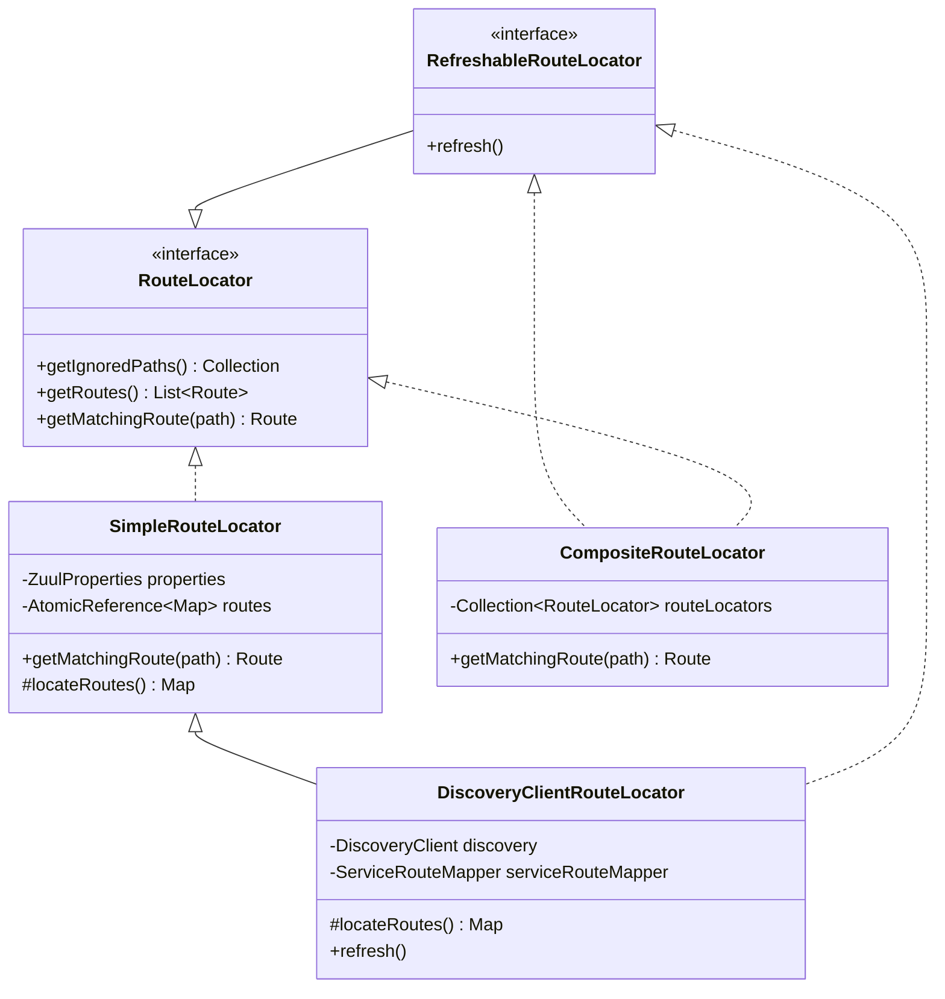

- **`SimpleRouteLocator`**：基于 `zuul.routes` 配置文件加载静态路由。
- **`DiscoveryClientRouteLocator`**：继承前者，额外通过 `DiscoveryClient`（Eureka）动态拉取服务列表，**自动为每个注册服务生成 `/${serviceId}/**` 路由**。
- **`CompositeRouteLocator`**：组合多个 RouteLocator，按顺序委托匹配（实际场景下把上述两者组合起来用）。

### 3.4 Route —— 路由对象

`getMatchingRoute()` 返回的 `Route` 核心字段：

```
Route {
    String id;            // 路由 id（通常是 serviceId）
    String fullPath;      // 完整匹配路径
    String path;          // 剥离前缀后的路径
    String location;      // ★ 转发目标（serviceId / http URL / forward: 路径）
    String prefix;        // 路由前缀（如 /api）
    Boolean retryable;    // 是否可重试
    Set    sensitiveHeaders; // 敏感头
    boolean prefixStripped;  // 是否剥离前缀
}
```

**`location` 是路由决策的关键**：它的值决定了走哪条转发通道（见第七章）。

---

## 四、启动与自动装配流程

### 4.1 `@EnableZuulProxy` 触发链

`@EnableZuulProxy`（字节码确认）：

```java
@EnableZuulServer       // 内含 @Import(ZuulServerMarkerConfiguration.class)
@Import(ZuulProxyMarkerConfiguration.class)  // 导入 Marker 配置类
public @interface EnableZuulProxy { }
```

`ZuulProxyMarkerConfiguration` 内部定义了一个空 `Marker` Bean。`ZuulServerAutoConfiguration` 和 `ZuulProxyAutoConfiguration` 通过 `@ConditionalOnBean(Marker.class)` 被激活——这是 Spring Cloud 标准的“标记驱动自动装配”模式。

### 4.2 自动装配做了什么

**`ZuulServerAutoConfiguration`**（基类，`@EnableZuulServer` 即可激活）注册：

| Bean | 作用 |
|------|------|
| `ZuulProperties` | 绑定 `zuul.*` 配置 |
| `SimpleRouteLocator` | 静态路由定位器 |
| `CompositeRouteLocator` | 组合路由定位器（primary） |
| `ZuulController` | 包装 `ZuulServlet` 的 Spring MVC 控制器 |
| `ZuulHandlerMapping` | 把路径映射到 `ZuulController` |
| `zuulServlet` (`ServletRegistrationBean`) | 注册 `ZuulServlet`，映射 `/zuul/*` |
| `zuulServletFilter` (`FilterRegistrationBean`) | 注册 `ZuulServletFilter`（替代/补充入口） |
| `ServletDetectionFilter`、`FormBodyWrapperFilter`、`DebugFilter`、`Servlet30WrapperFilter` | pre 过滤器 |
| `SendResponseFilter`、`SendErrorFilter`、`SendForwardFilter` | post/route/error 过滤器 |
| `ZuulFilterInitializer` | 把所有 `ZuulFilter` Bean 注册进 Zuul 核心 |
| `zuulRefreshRoutesListener` | 监听 `RoutesRefreshedEvent` 刷新路由 |

**`ZuulProxyAutoConfiguration`**（子类，`@EnableZuulProxy` 才激活，**整合 Eureka/Ribbon/Hystrix**）注册：

| Bean | 作用 |
|------|------|
| `DiscoveryClientRouteLocator` | 基于 Eureka 的动态路由定位器 |
| `PreDecorationFilter` | **路由决策**过滤器（pre） |
| `RibbonRoutingFilter` | **Ribbon 负载均衡转发**过滤器（route） |
| `SimpleHostRoutingFilter` | **直连 URL 转发**过滤器（route） |
| `ServiceRouteMapper` | 服务名→路由路径映射策略 |

### 4.3 过滤器注册进 Zuul 核心

Spring 容器中的 `ZuulFilter` Bean（如内置的 + 项目里的 `CustomFilter`）如何被 Zuul 核心感知？通过 `ZuulFilterInitializer`：

```
ZuulFilterInitializer {
    Map<String, ZuulFilter> filters;   // Spring 注入的所有 ZuulFilter Bean
    FilterLoader  filterLoader;
    FilterRegistry filterRegistry;     // 单例，内部是 ConcurrentHashMap

    contextInitialized() {
        // 遍历所有 ZuulFilter Bean，注册进 FilterRegistry 单例
        filters.forEach((name, f) -> filterRegistry.put(name, f));
    }
}
```

`FilterLoader.getFiltersByType(type)` 在运行时从 `FilterRegistry` 取出该类型的所有过滤器，并按 `filterOrder()` 排序后返回。

### 4.4 启动流程时序图

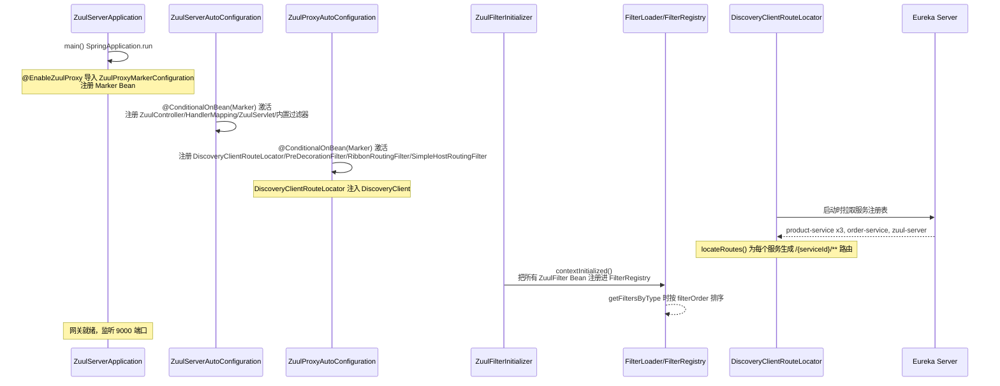

---

## 五、请求处理工作流程

### 5.1 请求入口的两种方式

Zuul 提供了两个等价的入口（由自动配置同时注册）：

1. **`ZuulServlet`**（映射 `/zuul/*`）：传统的 Servlet 入口。
2. **`ZuulHandlerMapping` + `ZuulController`**：把 ZuulServlet 包装成 Spring MVC 的 Controller，让**所有未匹配到具体 Controller 的路径**都走网关（本项目主路径走这条）。

`ZuulController` 继承 `ServletWrappingController`，内部包装了一个 `ZuulServlet` 实例。`ZuulHandlerMapping`（继承 `AbstractUrlHandlerMapping`）在 `lookupHandler()` 中用 `PathMatcher` 把请求路径匹配到 `ZuulController`。

> 默认情况下（`zuul.servletPath` 未配置或为 `/zuul`），网关拦截所有路径；通过 `zuul.servletPath` 可单独指定 Zuul 的 Servlet 映射前缀。

### 5.2 ZuulServlet 生命周期（字节码反编译确认）

`ZuulServlet.service()` 的核心逻辑（从字节码还原）：

```java
public void service(req, resp) {
    init(req, resp);                                   // 初始化 RequestContext
    RequestContext ctx = RequestContext.getCurrentContext();
    ctx.setZuulEngineRan();
    try {
        preRoute();                                   // 执行 pre 过滤器
    } catch (ZuulException e) {
        error();                                       // 执行 error 过滤器
        postRoute();                                  // 执行 post 过滤器（回写错误响应）
        ctx.unset(); return;
    }
    try {
        route();                                       // 执行 route 过滤器（转发）
    } catch (ZuulException e) {
        error(); postRoute(); ctx.unset(); return;
    }
    try {
        postRoute();                                  // 执行 post 过滤器（回写响应）
    } catch (ZuulException e) {
        error(); ctx.unset(); return;                  // 注意：此处不再调 postRoute，避免递归
    }
    ctx.unset();                                       // 清理 ThreadLocal
}
```

其中 `preRoute()`/`route()`/`postRoute()`/`error()` 委托给 `ZuulRunner`，再委托给 `FilterProcessor`：

```
ZuulServlet → ZuulRunner → FilterProcessor.preRoute()/route()/postRoute()/error()
```

`FilterProcessor` 是单例（`INSTANCE`），其 `preRoute()` 等方法内部调用 `runFilters("pre")`。

### 5.3 `runFilters` —— 过滤器编排核心逻辑（字节码确认）

`FilterProcessor.runFilters(String type)` 还原逻辑：

```java
public Object runFilters(String type) throws ZuulException {
    List<ZuulFilter> filters = FilterLoader.getInstance().getFiltersByType(type); // 取出并排序
    for (ZuulFilter f : filters) {
        Object res = processZuulFilter(f);   // 逐个执行
    }
}
```

`processZuulFilter(filter)` 还原逻辑：

```java
public Object processZuulFilter(ZuulFilter filter) {
    RequestContext ctx = RequestContext.getCurrentContext();
    long t = System.currentTimeMillis();
    if (ctx.debugRouting()) Debug.addRoutingDebug("Filter " + filter.filterType() + " " + filter.filterOrder() + " ...");
    ZuulFilterResult result = filter.runFilter();   // ★ 调用过滤器
    ExecutionStatus status = result.getStatus();
    long execTime = System.currentTimeMillis() - t;
    ctx.addFilterExecutionSummary(filter.getClass().getSimpleName(), status.name(), execTime);
    if (result.getException() != null) { /* 抛出 */ }
    return result.getResult();
}
```

`ZuulFilter.runFilter()`（基类）逻辑：

```java
public ZuulFilterResult runFilter() {
    ZuulFilterResult zr = new ZuulFilterResult();
    if (!isFilterDisabled()) {                 // 检查是否被配置禁用
        if (shouldFilter()) {                  // 调用子类 shouldFilter()
            try { zr.setResult(run()); }       // ★ 调用子类 run()
            catch (Throwable e) { zr.setException(e); }
        } else zr.setStatus(SKIPPED);
    }
    return zr;
}
```

> **每个过滤器都可以通过 `shouldFilter()` 决定是否执行**，这是路由分支的关键机制。

### 5.4 完整请求处理时序图

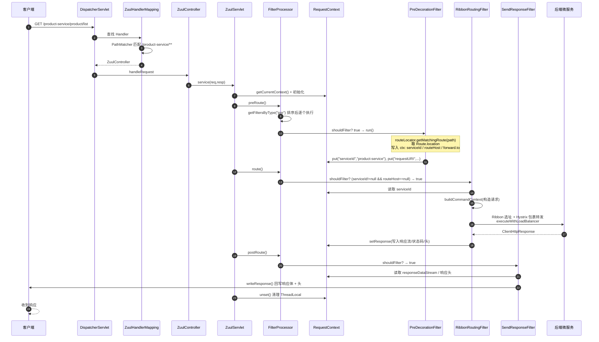

### 5.5 请求处理流程图（含异常分支）

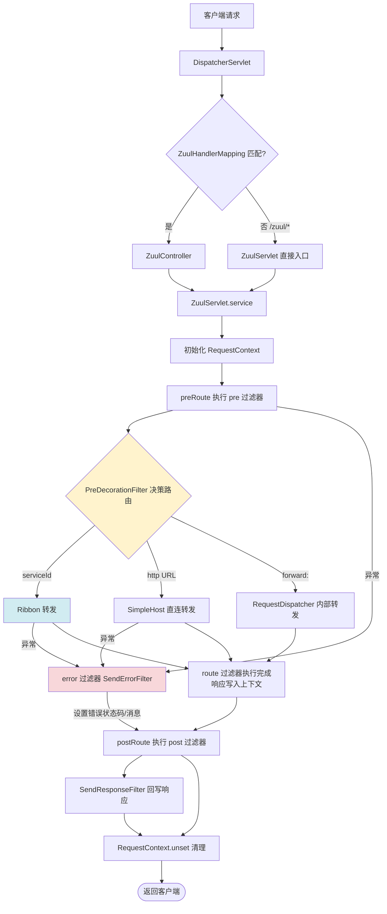

---

## 六、过滤器链执行原理

### 6.1 内置过滤器全表（filterType + filterOrder 字节码确认）

| 过滤器 | 类型 | order | shouldFilter 条件 | 作用 |
|--------|------|-------|------------------|------|
| `ServletDetectionFilter` | pre | -3 | 总是 | 标记请求是否经 DispatcherServlet（`isDispatcherServletRequest`） |
| `Servlet30WrapperFilter` | pre | -2 | 总是 | 把请求包装成 Servlet 3.0 的 `Servlet30RequestWrapper` |
| `FormBodyWrapperFilter` | pre | -1 | 表单请求 | 包装表单 body 以便转发 |
| `DebugFilter` | pre | 1 | `zuul.debug.request=true` | 开启调试，记录请求头 |
| `SendErrorFilter` | error | 0 | `ctx.throwable != null` | 设置错误响应（状态码、消息、转发到 `/error`） |
| `PreDecorationFilter` | pre | 5 | 总是 | **路由决策**：匹配路由、写入上下文、加代理头 |
| `RibbonRoutingFilter` | route | 10 | `serviceId != null && routeHost == null && sendZuulResponse` | **Ribbon 转发** |
| `SimpleHostRoutingFilter` | route | 100 | `routeHost != null && sendZuulResponse` | **直连 URL 转发** |
| `SendForwardFilter` | route | 500 | `forward.to != null` | **内部 forward 转发** |
| `LocationRewriteFilter` | post | — | 3xx 响应 | 重写 Location 头 |
| `SendResponseFilter` | post | 1000 | 总是（有响应时） | **回写响应** body 和头 |
| **本项目** `CustomFilter` | pre | 0 | 总是 | 打印 method + url |

### 6.2 过滤器执行顺序图

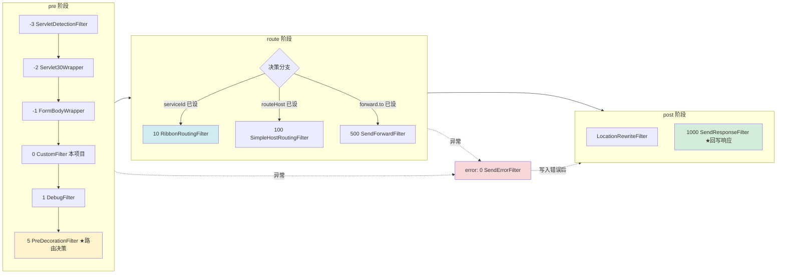

### 6.3 关键点

1. **过滤器排序**：同一类型内按 `filterOrder` 升序执行。`FilterLoader.getFiltersByType()` 返回的是排好序的列表（`ZuulFilter implements Comparable`，`compareTo` 按 order 比较）。
2. **短路机制**：`RequestContext.setSendZuulResponse(false)` 可让 route 过滤器不转发（shouldFilter 返回 false），但 pre/post 仍会执行——常用于网关层直接拒绝/限流。
3. **错误处理**：任意阶段抛 `ZuulException`，`ZuulServlet` 捕获后调 `error()` 执行 error 过滤器（`SendErrorFilter` 设置错误信息），随后**仍会执行 `postRoute()`**，由 `SendResponseFilter` 把错误响应真正写出去。
4. **动态禁用**：每个过滤器有 `disablePropertyName()`，对应 Archaius 配置项，运行时可通过配置中心动态关闭某个过滤器。

---

## 七、请求路由转发实现原理

这是 Zuul 网关最核心的能力。整个路由转发分为三步：**路由加载 → 路由决策 → 转发执行**。

### 7.1 第一步：路由加载（RouteLocator）

`DiscoveryClientRouteLocator.locateRoutes()` 还原逻辑（结合 Eureka）：

```java
protected LinkedHashMap<String, ZuulRoute> locateRoutes() {
    LinkedHashMap<String, ZuulRoute> routesMap = new LinkedHashMap<>();
    // 1. 先加载 zuul.routes.* 配置的静态路由
    routesMap.putAll(super.locateRoutes());
    // 2. 若配置允许服务发现（zuul.ignored-services 之外的服务）
    if (properties.getIgnoredServices() != ...) {
        List<String> services = discovery.getServices();   // ★ 从 Eureka 拉取
        for (String service : services) {
            if (!ignoredPatterns.contains(service) && !routesMap.containsKey(service)) {
                // 自动生成 /serviceId/** → serviceId 路由
                routesMap.put("/" + mapRouteToService(service) + "/**",
                             new ZuulRoute(service, "/" + service + "/**"));
            }
        }
    }
    return routesMap;
}
```

> **本项目 `zuul.routes` 全部注释掉了**，因此网关完全依赖 Eureka 自动发现：每个注册到 Eureka 的服务（`product-service`、`order-service`）自动获得 `/{serviceId}/**` 的路由。访问 `http://localhost:9000/product-service/product/list` 即可路由到 product-service 集群。

### 7.2 第二步：路由决策（PreDecorationFilter，order=5）

`PreDecorationFilter.run()` 字节码还原逻辑（决策树）：

```java
public Object run() {
    RequestContext ctx = RequestContext.getCurrentContext();
    HttpServletRequest req = ctx.getRequest();
    String requestURI = urlPathHelper.getPathWithinApplication(req); // ① 取请求路径
    if (insecurePath(requestURI)) throw new InsecureRequestPathException(requestURI);

    Route route = routeLocator.getMatchingRoute(requestURI);          // ② 匹配路由
    String location = route.getLocation();                            // ③ 取目标

    ctx.put(REQUEST_URI_KEY, route.getPath());                        // 剥离前缀后的 URI
    ctx.put(PROXY_KEY, route.getId());                                 // 路由 id
    ctx.put(RETRYABLE_KEY, route.getRetryable());                      // 是否可重试
    addIgnoredHeaders(sensitiveHeaders);                              // 屏蔽敏感头

    // ④ 根据 location 类型决策转发通道
    if (location.startsWith("http:") || location.startsWith("https:")) {
        ctx.setRouteHost(new URL(location));          // → SimpleHostRoutingFilter
        ctx.addOriginResponseHeader(SERVICE_HEADER, location);
    } else if (location.startsWith("forward:")) {
        ctx.put(FORWARD_TO_KEY, location.substring("forward:".length())); // → SendForwardFilter
    } else {
        ctx.put(SERVICE_ID_KEY, location);            // → RibbonRoutingFilter
        ctx.addOriginResponseHeader(SERVICE_HEADER, location);
    }
    addProxyHeaders(ctx, route);   // 加 X-Forwarded-For/Host/Port/Proto/Prefix
    return null;
}
```

### 7.3 路由决策流程图

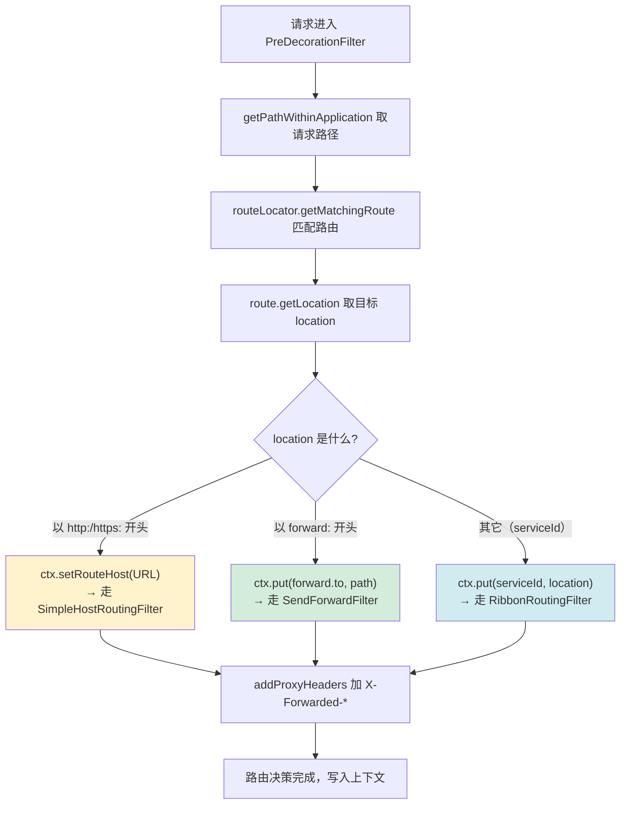

### 7.4 第三步：转发执行（三种通道）

#### 7.4.1 RibbonRoutingFilter（serviceId → 服务发现 + 负载均衡）

`shouldFilter()`（字节码确认）：`routeHost == null && ctx.get("serviceId") != null && sendZuulResponse()`

`run()` 还原逻辑：

```java
public Object run() {
    addIgnoredHeaders(...);
    RibbonCommandContext context = buildCommandContext(ctx);   // 构造转发上下文
    ClientHttpResponse response = forward(context);             // 执行转发
    setResponse(response);                                       // 响应写入 ctx
}

RibbonCommandContext buildCommandContext(RequestContext ctx) {
    HttpServletRequest req = ctx.getRequest();
    return new RibbonCommandContext(
        (String) ctx.get(SERVICE_ID_KEY),                       // product-service
        getVerb(req),                                            // GET/POST...
        helper.buildZuulRequestURI(req),                        // /product/list
        helper.buildZuulRequestQueryParams(req),                // query
        helper.buildZuulRequestHeaders(req),                    // headers
        getRequestBody(req),                                    // body
        ctx.get(RETRYABLE_KEY),                                 // retryable
        ...);
}

ClientHttpResponse forward(RibbonCommandContext context) {
    RibbonCommand command = ribbonCommandFactory.create(context); // 创建 HystrixCommand
    return command.execute();                                      // 执行（带熔断）
}
```

`ribbonCommandFactory.create()` 返回 `HttpClientRibbonCommand`（或 OkHttp/RestClient，按条件装配），它继承 `AbstractRibbonCommand extends HystrixCommand<ClientHttpResponse>`。

**`AbstractRibbonCommand.run()` 字节码还原**（这是 Ribbon + Hystrix 整合的核心）：

```java
protected ClientHttpResponse run() throws Exception {
    RequestContext ctx = RequestContext.getCurrentContext();
    RQ request = createRequest();                         // 构造 Ribbon ClientRequest
    if (client.isClientRetryable(request)) {
        response = client.execute(request, config);       // 可重试：普通执行
    } else {
        response = client.executeWithLoadBalancer(request, config); // ★ 负载均衡执行
    }
    if (isResponseTimedOut()) response.close();
    return new RibbonHttpResponse((HttpResponse) response); // 包装成 Spring 响应
}

protected ClientHttpResponse getFallback() {
    return getFallbackResponse();  // ★ Hystrix 降级：调用 FallbackProvider
}
```

> `executeWithLoadBalancer` 内部由 Ribbon 的 `LoadBalancerContext` 完成：从 Eureka 缓存的服务列表中按负载均衡策略（默认轮询 `RoundRobinRule`）选一个实例，再用 HttpClient 发起实际请求。

#### 7.4.2 SimpleHostRoutingFilter（http URL → 直连）

`shouldFilter()`：`routeHost != null && sendZuulResponse()`

`run()` 用 Apache `CloseableHttpClient` 直接打到 `routeHost` 指定的 URL，**不走 Ribbon 负载均衡**（即不选实例，直接用配置的固定地址）。适用于转发到外部系统或非 Eureka 注册的服务。

#### 7.4.3 SendForwardFilter（forward: → 内部转发）

`shouldFilter()`：`ctx.get("forward.to") != null`

`run()` 用 Servlet 的 `RequestDispatcher.forward()` 把请求转发到网关内部的另一个本地 Handler（如 Spring MVC 的 `/error`、`/actuator`），**不发出网关**。

### 7.5 三种转发方式对比

| 维度 | RibbonRoutingFilter | SimpleHostRoutingFilter | SendForwardFilter |
|------|---------------------|------------------------|-------------------|
| 触发条件 | `serviceId` 已设 | `routeHost` 已设 | `forward.to` 已设 |
| 转发目标 | Eureka 注册的服务 | 固定 http(s) URL | 网关内部路径 |
| 负载均衡 | ✅ Ribbon（选实例） | ❌ 直连固定地址 | ❌ 本地转发 |
| 熔断降级 | ✅ Hystrix 包裹 | ❌ | ❌ |
| HTTP 客户端 | HttpClient/OkHttp/RestClient（条件装配） | Apache HttpClient | Servlet RequestDispatcher |
| 典型场景 | 转发到内部微服务 | 转发到外部遗留系统 | 转发到网关本地端点 |

---

## 八、与 Spring Cloud 整合原理

### 8.1 整合架构总览

```mermaid
graph LR
    subgraph SpringBoot[Spring Boot 自动装配]
        EP[@EnableZuulProxy]
        EP -->|@Import Marker| AC1[ZuulServerAutoConfiguration]
        EP --> AC2[ZuulProxyAutoConfiguration]
    end

    subgraph Eureka整合
        DC[DiscoveryClient]
        DCRL[DiscoveryClientRouteLocator]
        DC -->|getServices| DCRL
        DCRL -->|生成 /serviceId/** 路由| Routes[(路由表)]
    end

    subgraph Ribbon整合
        RRF[RibbonRoutingFilter]
        RCF[RibbonCommandFactory]
        ABC[AbstractRibbonCommand<br/>extends HystrixCommand]
        LB[AbstractLoadBalancerAwareClient<br/>executeWithLoadBalancer]
        RRF -->|create+execute| RCF --> ABC --> LB
    end

    subgraph Hystrix整合
        ABC2[AbstractRibbonCommand]
        FP[FallbackProvider]
        ABC2 -->|失败降级| FP
        HC[hystrix.stream<br/>监控数据]
    end

    subgraph SpringMVC整合
        DS[DispatcherServlet]
        ZHM[ZuulHandlerMapping]
        ZC[ZuulController]
        DS --> ZHM --> ZC --> ZS[ZuulServlet]
    end

    AC1 --> SpringMVC整合
    AC2 --> Eureka整合
    AC2 --> Ribbon整合
    Ribbon整合 --> Hystrix整合
```

### 8.2 与 Eureka 整合（服务发现）

- `zuul-server` 引入 `spring-cloud-starter-netflix-eureka-client`，启动时作为 Eureka Client 向注册中心注册自身，并**拉取全量服务列表缓存到本地**。
- `DiscoveryClientRouteLocator` 持有 `DiscoveryClient`，`locateRoutes()` 调用 `discovery.getServices()` 拿到所有服务名，自动生成路由。
- 本项目 `zuul-server` 的 `application.yaml`：

```yaml
eureka:
  instance:
    prefer-ip-address: true
    instance-id: ${spring.cloud.client.ip-address}:${server.port}
  client:
    service-url:
      defaultZone: http://localhost:8761/eureka/,http://localhost:8762/eureka/
```

  > 网关缓存 Eureka 服务列表后，**转发时不再每次查 Eureka**，而是从本地缓存 + Ribbon 周期性刷新，降低注册中心压力。

### 8.3 与 Ribbon 整合（客户端负载均衡）

- 当 `RibbonRoutingFilter` 转发到 `serviceId` 时，使用 `SpringClientFactory` 为每个 serviceId 创建独立的 Ribbon 上下文（`RibbonLoadBalancerContext`）。
- Ribbon 从 Eureka 缓存中拿到该 serviceId 的所有实例（如 `product-service` 的 9090/9091/9092），按 `IRule`（默认 `ZoneAvoidanceRule`，常退化为轮询）选一个实例。
- `AbstractLoadBalancerAwareClient.executeWithLoadBalancer()` 的执行链：

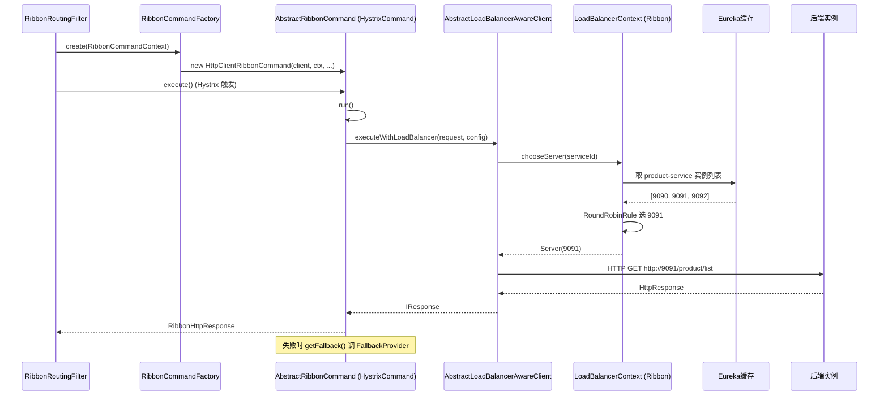

### 8.4 与 Hystrix 整合（熔断降级）

- `AbstractRibbonCommand extends HystrixCommand<ClientHttpResponse>`：每一次 Ribbon 转发都被包裹成一个 Hystrix 命令，享有**熔断、超时、线程/信号量隔离、降级**能力。
- 降级逻辑：`getFallback()` 调用 `FallbackProvider`（旧接口 `ZuulFallbackProvider`）。用户可为每个 serviceId 注册降级提供者，返回兜底响应。
- 超时配置（`AbstractRibbonCommand` 静态方法 `getHystrixTimeout`/`getRibbonTimeout`）：Hystrix 超时需大于 Ribbon 超时，否则 Hystrix 先熔断会导致 Ribbon 重试失效。

```yaml
# Zuul 的 Hystrix 隔离策略配置（ZuulProperties 字段确认）
zuul:
  ribbon-isolation-strategy: SEMAPHORE   # 默认信号量隔离（也可 THREAD）
  semaphore:
    max-semaphores: 100
  threadPool:
    useSeparateThreadPools: true
```

- 本项目还集成了 `hystrix-dashboard` + `@EnableHystrixDashboard`，并暴露 `hystrix.stream`：

```yaml
management:
  endpoints:
    web:
      exposure:
        include: hystrix.stream
hystrix:
  dashboard:
    proxyStreamAllowList: localhost, 127.0.0.1
```

  可在 Dashboard 中可视化网关转发各服务时的熔断状态。

### 8.5 与 Spring MVC 整合（接入点）

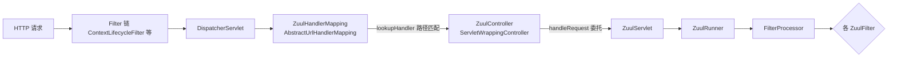

- `ZuulController` 继承 `ServletWrappingController`，内部 new 一个 `ZuulServlet`，把 Spring MVC 的 `handleRequest` 委托给 Servlet 的 `service`。
- `ZuulHandlerMapping` 在 `registerHandlers()` / `lookupHandler()` 中把所有路由路径注册到 `ZuulController`。
- 另外注册的 `ZuulServletFilter`（`ZuulServletFilter`）作为 Servlet Filter，在某些场景（如 `zuul.servletPath` 配置时）作为补充入口。

---

## 九、底层实现原理补充

### 9.1 RequestContext 的 ThreadLocal 模型

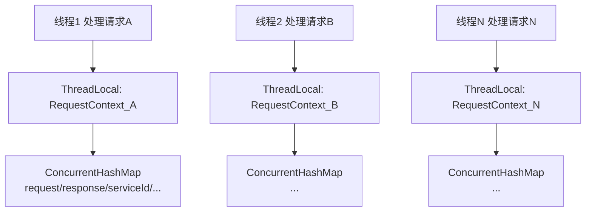

- `RequestContext extends ConcurrentHashMap`，`ThreadLocal<? extends RequestContext>` 保证每个请求线程独立。
- **Zuul 1.x 是同步阻塞模型**：一个请求占用一个容器线程，从 pre 到 route 到 post 全程同线程。因此高并发下线程数是瓶颈，这也是 Zuul 2.x 走异步的根本原因。
- `ZuulServlet` 结尾必须 `ctx.unset()` 清理 ThreadLocal，防止线程池复用导致内存泄漏与串数据。
- `ContextLifecycleFilter`（zuul-core）作为 Servlet Filter，在请求开始/结束时负责 `RequestContext` 的初始化与清理兜底。

### 9.2 过滤器的动态加载（Groovy 热部署）

zuul-core 内置了一套**过滤器热加载机制**（Netflix 内部用于不停机更新网关逻辑）：

```
FilterFileManager  ── 周期扫描指定目录 ──▶ GroovyCompiler 编译 .groovy
        │                                      │
        └──── putFilter(file) ──▶ FilterRegistry.put(name, filter)
                                              │
              FilterLoader.getFiltersByType ──┘  （运行时取出已编译的过滤器）
```

- `FilterLoader` 维护 `filterClassLastModified`（文件最后修改时间），文件变化时重新编译，实现过滤器热更新。
- Spring Cloud 场景下，过滤器通常是 Spring Bean（由 `ZuulFilterInitializer` 注册），不使用 Groovy 动态加载；但该机制仍存在，可用于自定义扩展。

### 9.3 敏感头处理（sensitiveHeaders）

为防止敏感信息（Cookie、Authorization 等）在服务间泄露，Zuul 支持：

```yaml
zuul:
  sensitive-headers: Cookie,Set-Cookie,Authorization   # 全局敏感头（默认）
  routes:
    product-service:
      sensitive-headers:        # 路由级覆盖
      custom-sensitive-headers: true
```

- `ProxyRequestHelper.buildZuulRequestHeaders()` 转发前剔除敏感头。
- `ProxyRequestHelper` 持有 `ignoredHeaders` 集合，`addIgnoredHeaders()` 可运行时追加。
- 默认 `SECURITY_HEADERS = [Cookie, Set-Cookie, Authorization]`。

### 9.4 重试机制

- `Route.retryable` 决定 route 过滤器是否可重试（`ctx.put(RETRYABLE_KEY, ...)`）。
- Ribbon 侧：`RetryHandler`（`HttpClientRibbonCommand` 用 `isClientRetryable` 判断），可配置 `MaxAutoRetries`、`MaxAutoRetriesNextServer`。
- 全局：`zuul.retryable=true` 开启重试。
- **注意**：重试与 Hystrix 超时需协调，Hystrix 超时应大于 `（MaxAutoRetries + MaxAutoRetriesNextServer）× ReadTimeout`，否则重试被熔断截断。

### 9.5 超时控制（双重超时）

| 层 | 配置 | 说明 |
|----|------|------|
| Ribbon | `ribbon.ReadTimeout` / `ribbon.ConnectTimeout` | 单次请求连接/读取超时 |
| Hystrix | `hystrix.command.default.execution.isolation.thread.timeoutInMilliseconds` | 整个命令超时（包裹 Ribbon） |
| Zuul | `zuul.host.connect-timeout-millis` / `socket-timeout-millis` | 仅对 SimpleHostRoutingFilter（直连）生效 |

> Ribbon 路由的连接超时由 Ribbon 管理；直连路由（SimpleHost）由 `zuul.host.*` 管理，两者不混用。

### 9.6 代理头（X-Forwarded-*）

`PreDecorationFilter.addProxyHeaders()` 自动添加：

| 头 | 来源 |
|----|------|
| `X-Forwarded-For` | 客户端 IP 链 |
| `X-Forwarded-Host` | 原 Host |
| `X-Forwarded-Port` | 原端口 |
| `X-Forwarded-Proto` | 原协议（http/https） |
| `X-Forwarded-Prefix` | 路由前缀 |
| `X-Zuul-Service` / `X-Zuul-ServiceId` | 目标服务标识 |

可通过 `zuul.add-proxy-headers=false` / `zuul.add-host-header=true` 调整。

### 9.7 CORS 跨域

`ZuulServerAutoConfiguration` 内部有 `ZuulCorsRegistry`，支持通过 `@CrossOrigin` 或全局配置处理跨域。CORS 预检（OPTIONS）请求在 pre 阶段即可被处理。

### 9.8 Actuator 端点

spring-cloud-netflix-zuul 暴露两个管理端点（`ZuulProxyAutoConfiguration$EndpointConfiguration`）：

| 端点 | 作用 |
|------|------|
| `GET /actuator/routes` | 返回当前所有路由（`RoutesEndpoint`） |
| `GET /actuator/filters` | 返回所有过滤器及其类型、顺序（`FiltersEndpoint`） |
| `POST /actuator/refresh` | 触发 `RoutesRefreshedEvent`，重新加载路由 |

### 9.9 路由刷新机制

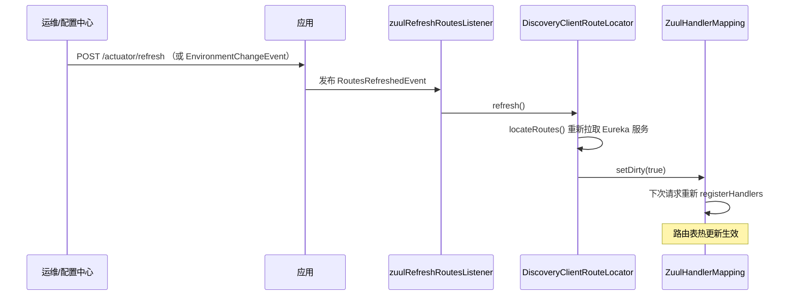

- `ZuulServerAutoConfiguration.zuulRefreshRoutesListener()` 监听 `RoutesRefreshedEvent`。
- `SimpleHostRoutingFilter` 还实现了 `ApplicationListener<EnvironmentChangeEvent>`，配置变更时重建 HttpClient。

### 9.10 ZuulProperties 关键配置项（字段确认）

```
zuul:
  prefix: /api              # 全局路由前缀
  strip-prefix: true        # 转发时是否剥离前缀
  retryable: false          # 全局是否可重试
  add-proxy-headers: true   # 加 X-Forwarded-*
  add-host-header: false
  ignored-services:         # 忽略自动路由的服务
  ignored-patterns:         # 忽略的路径模式
  ignored-headers:          # 转发时忽略的头
  sensitive-headers: Cookie,Set-Cookie,Authorization
  servlet-path: /zuul       # ZuulServlet 映射路径
  ignore-local-service: true # 是否忽略本地服务
  host:                     # SimpleHostRouting 连接池
    connect-timeout-millis: 2000
    socket-timeout-millis: 10000
    max-total-connections: 200
  ribbon-isolation-strategy: SEMAPHORE  # Hystrix 隔离策略
  semaphore.max-semaphores: 100
  threadPool.useSeparateThreadPools: false
  routes:
    <routeName>:
      path: /xxx/**
      serviceId: xxx-service   # 或 url: http://...
      stripPrefix: true
      retryable: true
```

---

## 十、本项目示例调用链分析

### 10.1 场景：访问 `http://localhost:9000/product-service/product/list`

完整调用链（结合本项目代码）：

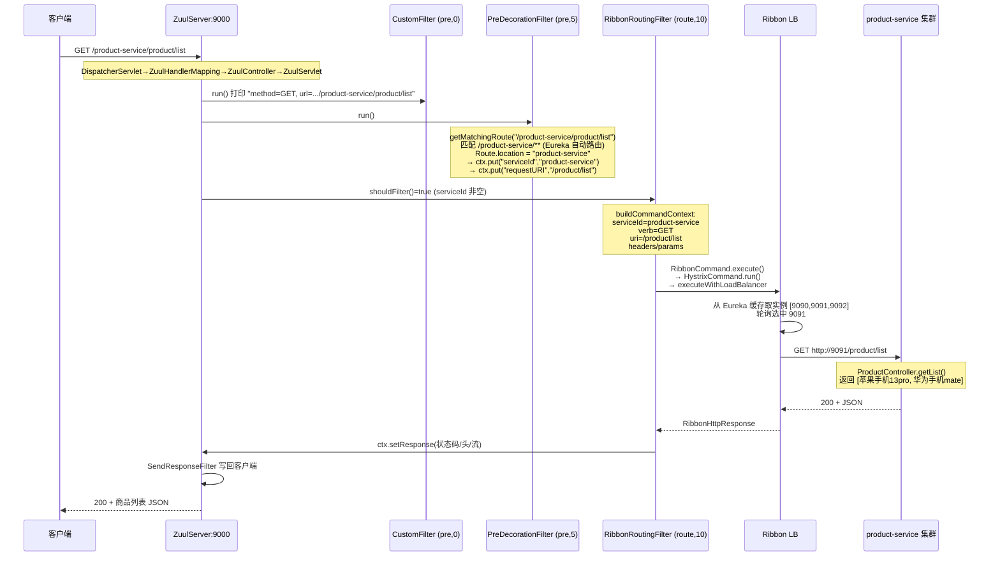

### 10.2 场景：order-service 的服务间调用（不经网关）

注意 `order-service` 调用 `product-service` 用的是 `@LoadBalanced RestTemplate`，**直接走 Ribbon 服务间调用，不经过网关**：

```java
// OrderServiceApplication
@Bean @LoadBalanced
public RestTemplate restTemplate() { return new RestTemplate(); }

// OrderController
restTemplate.exchange("http://product-service/product/list", GET, null, ...);
```

这是 Spring Cloud 两种服务调用方式的对比：

| 方式 | 调用方 | 路径 | 负载均衡 | 是否过网关 |
|------|--------|------|---------|-----------|
| 网关转发 | 外部客户端 | `http://网关:9000/product-service/**` | Ribbon（网关内） | ✅ |
| RestTemplate | 内部服务 | `http://product-service/**` | Ribbon（消费方内） | ❌ |

### 10.3 自定义过滤器挂载点

本项目 `CustomFilter`（pre, order=0）挂在 pre 阶段最前，在 `PreDecorationFilter`（order=5）之前执行，因此**此时路由尚未决策**，适合做统一的日志、鉴权、限流入口。若要修改路由决策结果，应放到 order > 5 的 pre 过滤器中读 `serviceId`/`routeHost`。

### 10.4 多 Eureka 高可用配置说明

本项目 `zuul-server` 配置了两个注册中心地址：

```yaml
defaultZone: http://localhost:8761/eureka/,http://localhost:8762/eureka/
```

但工程中只有一个 `eureka-server`（8761）。生产环境应部署多个 Eureka 互相注册形成集群，网关与微服务都配置多个 `defaultZone`，任一注册中心宕机不影响服务发现。

---

## 十一、Zuul 1.x 的局限与演进

### 11.1 Zuul 1.x 的局限

1. **同步阻塞 I/O**：每个请求独占一个 Servlet 容器线程，I/O 等待期间线程被阻塞，高并发下线程数暴涨、上下文切换开销大。
2. **不支持长连接/流式**：背压能力弱，不适合大文件、SSE、WebSocket。
3. **已停止维护**：Spring Cloud Netflix 已进入维护模式，官方推荐迁移到 **Spring Cloud Gateway**（基于 Reactor + Netty，异步非阻塞）。

### 11.2 Zuul 1.x vs Zuul 2.x vs Spring Cloud Gateway

| 维度 | Zuul 1.x（本项目） | Zuul 2.x | Spring Cloud Gateway |
|------|-------------------|----------|---------------------|
| I/O 模型 | 同步阻塞（Servlet） | 异步非阻塞（Netty） | 异步非阻塞（Reactor + Netty） |
| 整合 Spring Cloud | ✅ 深度整合 | ❌ 未整合 | ✅ 原生 |
| 过滤器模型 | 同步 `ZuulFilter` | 异步 `Filter` | `GatewayFilter`/`GlobalFilter`（Reactor） |
| 线程模型 | 一请求一线程 | 事件循环 | 事件循环 |
| 维护状态 | 维护模式 | Netflix 内部使用 | 主推 |

### 11.3 Zuul 1.x 设计的可取之处

尽管有局限，Zuul 的**过滤器链 + RequestContext 上下文总线 + 路由定位器**这一架构设计影响深远：

- 过滤器分类型（pre/route/post/error）+ order 排序的模型，被 Spring Cloud Gateway 的 `GatewayFilter` 体系继承。
- `RouteLocator` 动态路由的抽象，演化为 Gateway 的 `RouteDefinitionLocator`。
- 与 Eureka/Ribbon/Hystrix 的整合范式，是微服务网关的经典范式。

---

## 十二、总结

### 12.1 Zuul 实现原理一句话概括

> Zuul 1.x 是一个**基于 Servlet 的同步阻塞微服务网关**：它通过 `@EnableZuulProxy` 触发 Spring Boot 自动装配，把 `ZuulServlet` 嵌入 Spring MVC；请求到达后由 `FilterProcessor` 按 `pre → route → post`（异常走 `error`）顺序执行过滤器链，过滤器间通过 `ThreadLocal` 的 `RequestContext` 共享状态；`PreDecorationFilter` 做路由决策，根据目标类型选择 `RibbonRoutingFilter`（服务发现 + 负载均衡 + 熔断）、`SimpleHostRoutingFilter`（直连）或 `SendForwardFilter`（内部转发）完成转发，最后由 `SendResponseFilter` 回写响应。

### 12.2 核心机制速查

| 机制 | 关键类 | 关键点 |
|------|--------|--------|
| 自动装配 | `@EnableZuulProxy` → `ZuulProxyAutoConfiguration` | Marker Bean 驱动条件装配 |
| 请求入口 | `ZuulHandlerMapping` → `ZuulController` → `ZuulServlet` | 嵌入 Spring MVC |
| 生命周期 | `ZuulServlet` → `ZuulRunner` → `FilterProcessor` | pre→route→post，异常 error |
| 过滤器注册 | `ZuulFilterInitializer` → `FilterRegistry` → `FilterLoader` | Spring Bean 注册进 Zuul 单例 |
| 上下文传递 | `RequestContext`（ThreadLocal + ConcurrentHashMap） | 过滤器间通信总线 |
| 路由加载 | `DiscoveryClientRouteLocator.locateRoutes()` | Eureka 自动生成 /serviceId/** 路由 |
| 路由决策 | `PreDecorationFilter.run()` | 根据 `Route.location` 分发到三种转发通道 |
| Ribbon 转发 | `RibbonRoutingFilter` → `AbstractRibbonCommand` | `executeWithLoadBalancer` 选址 |
| 熔断降级 | `AbstractRibbonCommand extends HystrixCommand` | `getFallback()` 兜底 |
| 响应回写 | `SendResponseFilter` | 写 body + 头 |
| 错误处理 | `SendErrorFilter`（error,0）+ `SendResponseFilter` | 设置错误并写出 |
| 动态刷新 | `RoutesRefreshedEvent` → `refresh()` → `setDirty` | 路由热更新 |

### 12.3 请求转发的本质

一次网关转发的本质是：**用 Servlet 容器线程接收请求 → 在 ThreadLocal 上下文中做路由决策与请求加工 → 通过 Hystrix 包裹的 Ribbon 命令发起带负载均衡的远程调用 → 把后端响应塞回上下文 → 同步写回客户端**。Zuul 把这个过程拆解成可插拔的过滤器链，使得路由、鉴权、限流、日志、熔断等横切关注点得以灵活组合。

---

> **附录：本文档所有结论均基于源码验证**
> - 项目源码：`zuul-hoxton` 各模块
> - Netflix 核心：`zuul-core-1.3.1.jar` 字节码反编译（`ZuulServlet`/`ZuulRunner`/`FilterProcessor`/`RequestContext`/`ZuulFilter`/`FilterLoader`/`FilterRegistry`）
> - Spring 整合：`spring-cloud-netflix-zuul-2.2.9.RELEASE.jar` 字节码反编译（`ZuulServerAutoConfiguration`/`ZuulProxyAutoConfiguration`/`PreDecorationFilter`/`RibbonRoutingFilter`/`SimpleHostRoutingFilter`/`AbstractRibbonCommand`/`DiscoveryClientRouteLocator`/`ZuulFilterInitializer`/`FilterConstants` 等）
> - 版本锁定：`spring-cloud-dependencies-Hoxton.SR12.pom` 确认 `spring-cloud-netflix.version = 2.2.9.RELEASE`
